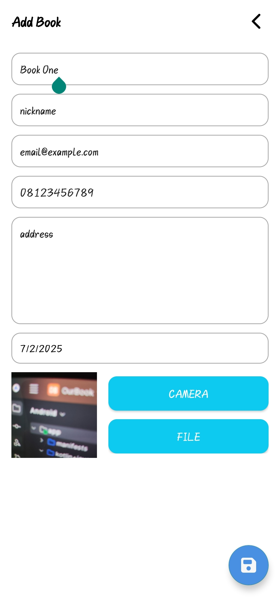

# OurBook

**OurBook** is an Android app for managing book collections, featuring clean UI/UX with add, edit, delete, and visual feedback. It uses SQLite for local storage and integrates Lottie animations, SweetAlert, and DatePicker for an enhanced experience.


---

## ✨ Features

- 🚀 Animated **Splash Screen** with Lottie 
- 📋 **MainActivity** shows all added books  
- ➕ **Add / Edit Book** with:
  - Input validation
  - DatePicker for publish date
  - Upload images (camera or storage)
- 🗑️ **Delete entries** with SweetAlert confirmation  
- ℹ️ **About Page** for app info 
- 💾 **Local SQLite storage** 

---

## 🛠️ Tech Stack

- **Java / Kotlin**  
- **SQLite**  
- **Lottie**  
- **SweetAlert**  
- **DatePickerDialog**  
- **Camera & File Access**  

---

## 📦 Installation

1. Clone this repository:

```bash
git clone https://github.com/raffyhidayatulloh/ourbook.git
```

2. Open project in Android Studio

3. Sync Gradle and run on your emulator or device

---

## 📸 Screenshots

| Splash Screen | Main Activity | Add Activity |
|---------------|----------------|----------------|
|  |  |  |
